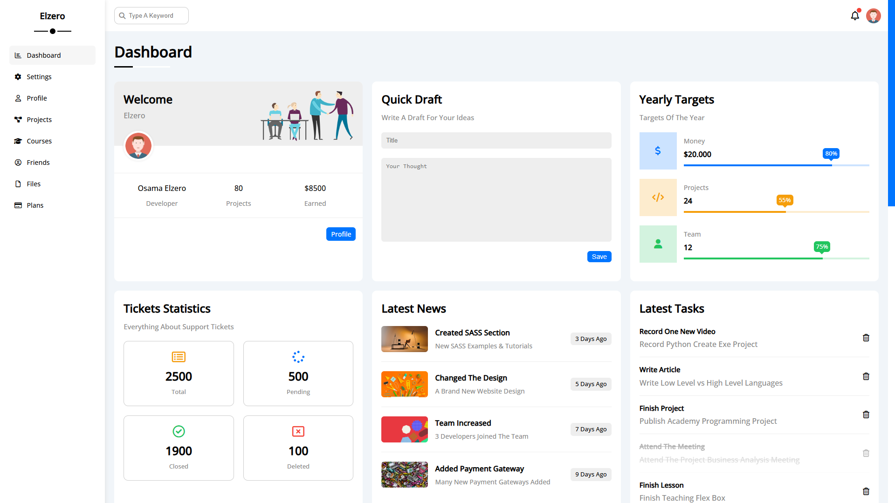
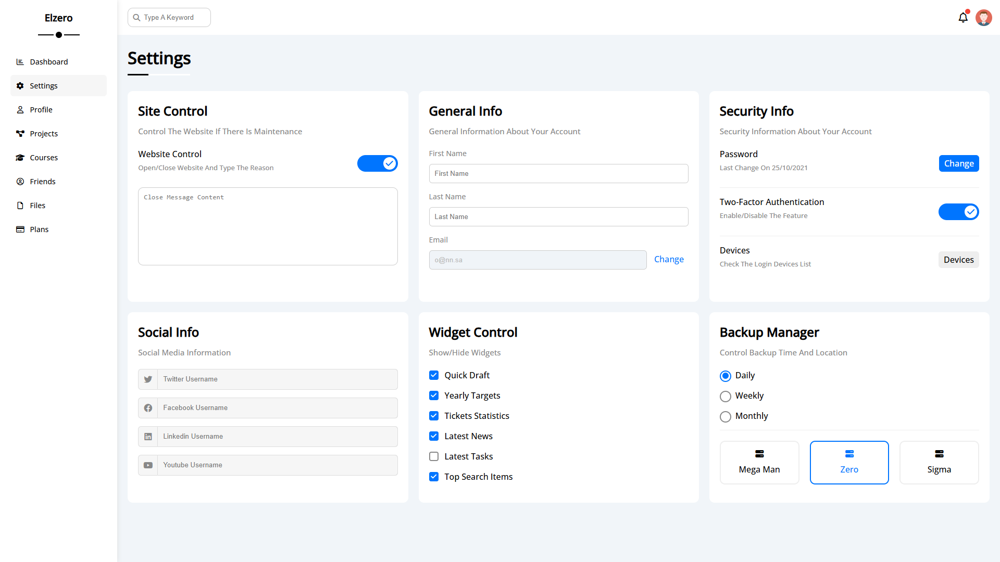
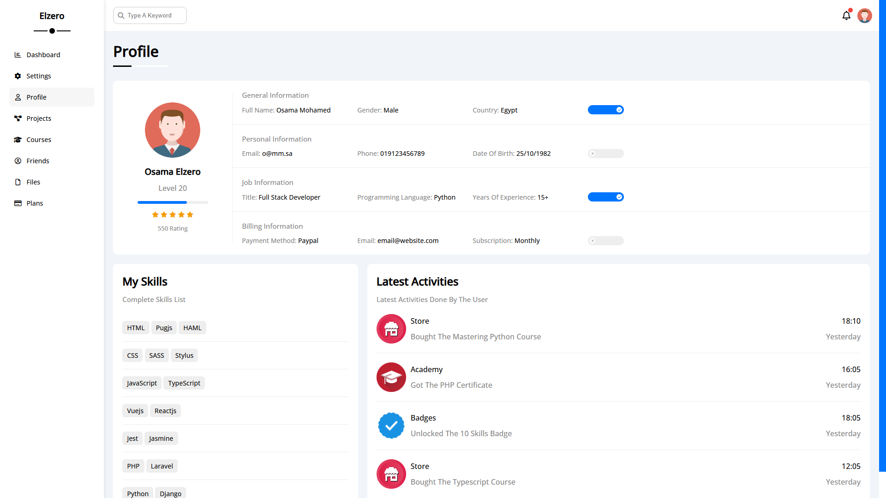
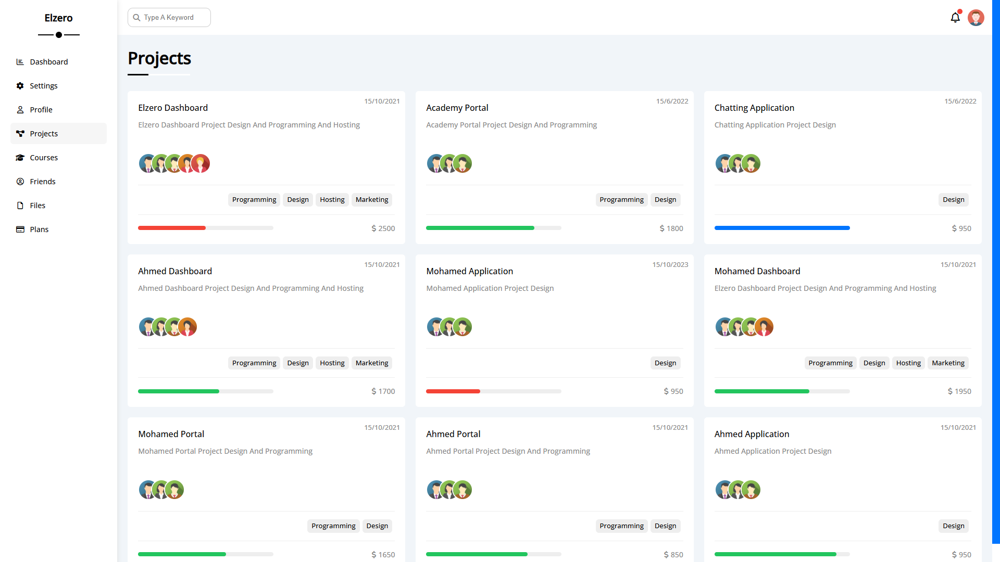
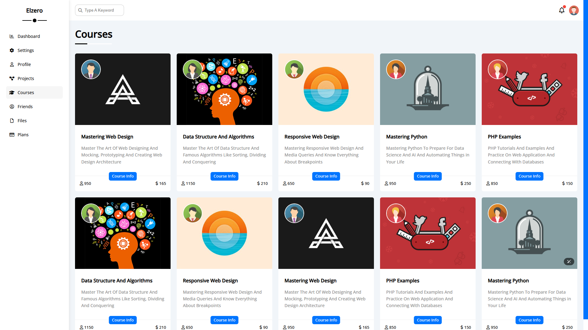
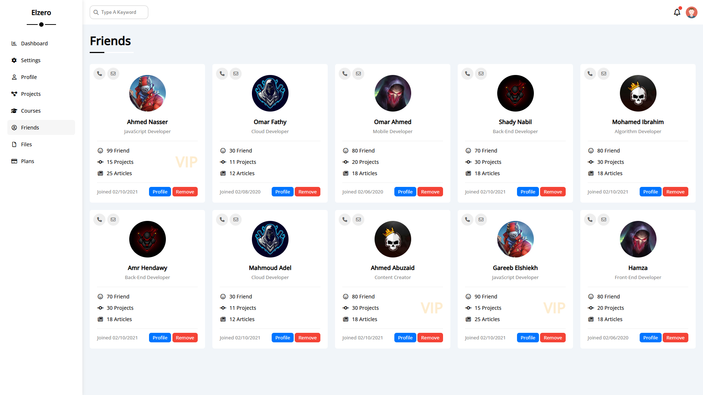
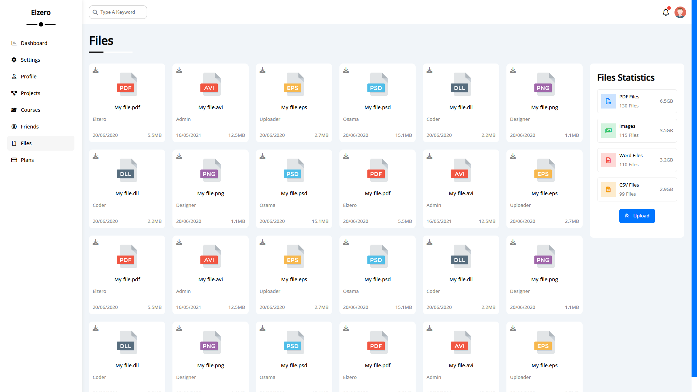
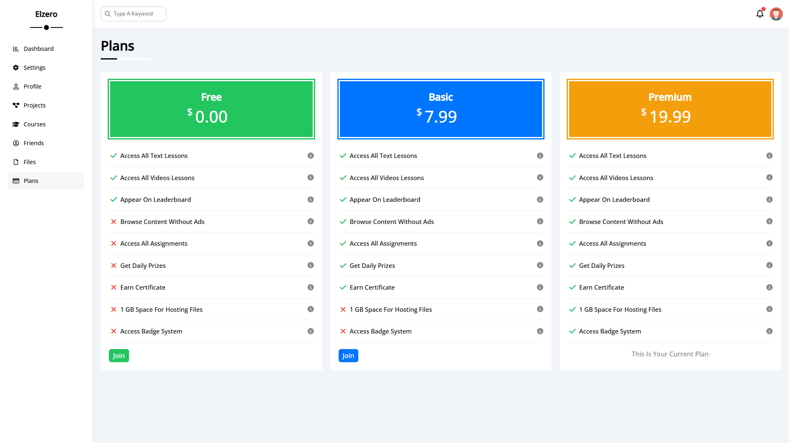

# 📊 Admin Dashboard

A responsive and modern Admin Dashboard built using **HTML5** and **CSS3** only (No JavaScript).  
Designed as part of a practice project to master layout techniques, Flexbox, and Grid.

---

## 🚀 Live Demo

🌐 [View Live](https://codebyabdo.github.io/HTML_CSS_Fourth_Project/)

---

## 📸 Screenshots

| Page      | Screenshot |
|-----------|------------|
| Dashboard |  |
| Settings  |  |
| Profile   |  |
| Projects  |  |
| Courses   |  |
| Friends   |  |
| Files     |  |
| Plans     |  |

> 📂 **Note:** Place all screenshots inside a folder called `screenshots/` in the root of your project.

---

## ✨ Features

- Clean and modern UI layout  
- Sidebar navigation with icons  
- 8 Pages:
  - Dashboard, Settings, Profile, Projects, Courses, Friends, Files, Plans  
- Responsive design using media queries  
- Built entirely with **HTML** and **CSS** – no JavaScript!

---

## 🛠 Tech Stack

- HTML5  
- CSS3  
  - Flexbox  
  - CSS Grid  
  - Media Queries  
  - Custom Properties (CSS Variables)

---

## 📦 Getting Started

```bash
git clone https://github.com/abd-el-rahman-adel-dev/HTML_CSS_Fourth_Project.git
cd HTML_CSS_Fourth_Project
open index.html
```

Or just double-click `index.html` in your file manager.

---
## 📁 Project Structure

```
📦 HTML_CSS_Fourth_Project
┣ 📂 css
┃ ┗ 📜 style.css
┣ 📂 images
┣ 📂 screenshots
┃ ┣ 📸 dashboard.png
┃ ┣ 📸 settings.png
┃ ┣ 📸 profile.png
┃ ┣ 📸 projects.png
┃ ┣ 📸 courses.png
┃ ┣ 📸 friends.png
┃ ┣ 📸 files.png
┃ ┗ 📸 plans.png
┣ 📜 index.html

```

---

## 📄 License

This project is licensed under the [MIT License](./LICENSE).

---

## 🙋‍♂️ Author

- [Abd El-Rahman Adel](https://github.com/codebyabdo)
- [LinkedIn](https://www.linkedin.com/in/codebyabdo)

---

> ⭐ Feel free to star this repo if you like the project!

